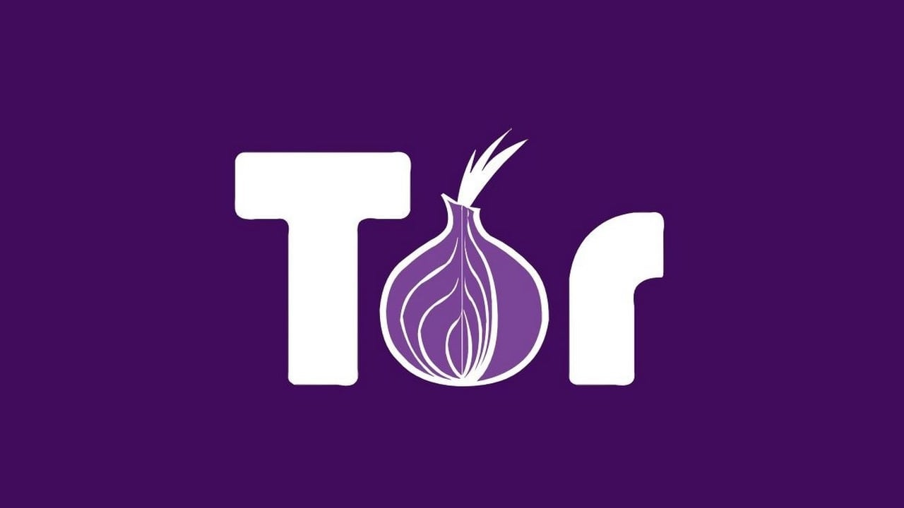

# An evaluation of TOR

## Authors

- **Leonardo Menti**: <em>leonardo.menti@estudiantat.upc.edu</em>
- **Jorre De Backer**:

## Introduction

Tor (The Onion Router) is a free and open source software that provide
anonymous communication over the internet. It is based on the onion routing
protocol, an anonymization technique of communications in a 
telecommunications network. 

## What you need

`brew install tor`

`pip install 'requests[socks]'`
